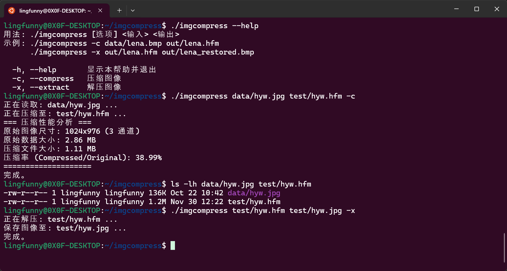
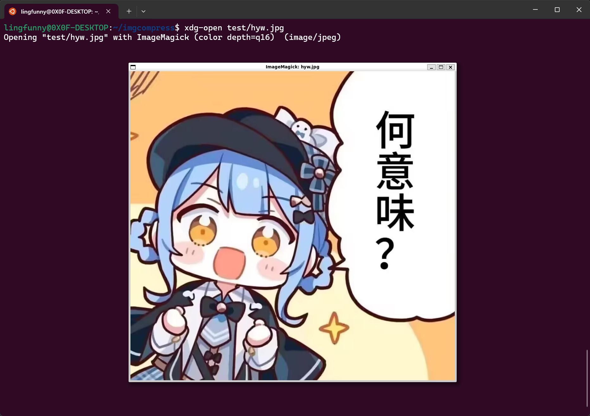

# Project 3 实验报告

学号：24344064
姓名：廖海涛
项目地址：[https://github.com/lingfunny/imgcompress](https://github.com/lingfunny/imgcompress)

## 程序功能简要说明

项目实现了一个基于 Huffman 编码的图像无损压缩程序。

程序核心采用差分编码后建立哈夫曼树，并使用范式哈夫曼编码的策略。主要支持以下功能：

1. 利用 OpenCV 库读取常见格式图片文件；
2. 实现基于差分编码和范式哈夫曼编码的图像无损压缩算法；
3. 实现压缩文件的解压缩功能，恢复原始图像数据；
4. 计算并输出压缩比和压缩时间等性能指标。

## 程序运行截图

程序功能实现截图如下：



图像正常还原：



## 部分关键代码及其说明

首先需要差分预处理，计算出相邻像素的插值，利用空间局部性：

```cpp
// src/ImageLoader.cpp
std::vector<std::uint8_t> buildResidualChannel(const cv::Mat& image, int channel) {
    // ... 
    for (int row = 0; row < height; ++row) {
        // ... 
        for (int col = 0; col < width; ++col) {
            // ...
            if (col == 0) {
                residuals[index] = current; // 第一列保留原值
            } else {
                // 计算当前像素与左侧像素的差值
                // 使用 uint8_t 的溢出特性自动处理负数情况，解码时同样利用溢出特性还原
                const std::uint8_t left = rowPtr[col - 1][channel];
                const int diff = static_cast<int>(current) - static_cast<int>(left);
                residuals[index] = static_cast<std::uint8_t>(diff & 0xFF);
            }
        }
    }
    return residuals;
}
```

接着是构建 Huffman 树：

```cpp
// src/ImageLoader.cpp
// ...
while (queue.size() > 1) {
    Node* a = queue.top(); queue.pop();
    Node* b = queue.top(); queue.pop();

    auto parent = std::make_unique<Node>();
    parent->freq = a->freq + b->freq;
    parent->left = a;
    parent->right = b;
    queue.push(parent.get());
    // ...
}
// 递归遍历树，记录每个叶子节点（符号）的深度即为码长
auto assignLengths = [&](auto&& self, Node* node, std::uint8_t depth) -> void {
    if (node->symbol >= 0) {
        lengths[node->symbol] = depth == 0 ? 1 : depth;
        return;
    }
    self(self, node->left, depth + 1);
    self(self, node->right, depth + 1);
};
```

最后需要利用范式哈夫曼编码生成编码表：

```cpp
// src/ImageLoader.cpp
HuffmanTable buildCanonicalTable(const std::array<std::uint8_t, 256>& lengths) {
    // ... 统计每个长度的码字数量 ...
    
    // 生成每个长度的起始编码
    std::uint32_t code = 0;
    for (std::uint8_t length = 1; length <= maxLength; ++length) {
        code = (code + count[length - 1]) << 1;
        nextCode[length] = code;
    }

    // 为每个符号分配编码
    for (int symbol : symbols) { // symbols 已按 (码长, 符号值) 排序
        const std::uint8_t length = lengths[symbol];
        table.codes[symbol] = nextCode[length]++;
    }
    return table;
}
```

## 程序运行方式简要说明

本项目基于 CMake 构建系统，依赖 OpenCV 库。请确保系统中已安装 OpenCV。

### 环境依赖

- C++17 编译器 (GCC/Clang/MSVC)
- CMake >= 3.10
- OpenCV (用于图像 I/O)

### 构建步骤

在根目录执行以下命令：

```bash
mkdir build
cd build
cmake ..
make  # Linux/macOS
```

### 运行命令

程序的可执行文件为 `imgcompress`，使用方法如下：

```bash
用法: ./imgcompress [选项] <输入> <输出>
示例: ./imgcompress -c data/lena.bmp out/lena.hfm
      ./imgcompress -x out/lena.hfm out/lena_restored.bmp

  -h, --help       显示本帮助并退出
  -c, --compress   压缩图像
  -x, --extract    解压图像
```